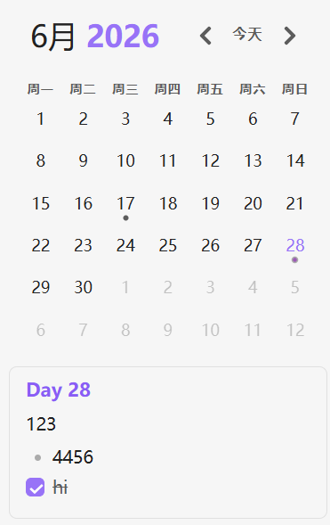

# obsidian-calendar-plugin

这是一个为 [Obsidian](https://obsidian.md/) 设计的插件，创建一个简单的日历视图，用于可视化和导航您的每日笔记。


## 使用方法

在设置菜单中启用插件后，您应该会在右侧边栏看到日历视图。

该插件会读取您的每日笔记设置，以了解您的日期格式、每日笔记模板位置以及新创建的每日笔记的位置。

## 功能特性

- 跳转到任何**每日笔记**。
- 为没有笔记的日期创建新的每日笔记。（这对于补充旧笔记或提前规划未来的笔记很有帮助！这将使用您当前的**每日笔记**模板！）
- 可视化您的写作。每天都有一个计量器，用于近似显示您当天写了多少内容。
- 使用**每周笔记**增加一个组织层级！它们的工作方式与每日笔记类似，但有自己的自定义选项。

## 设置选项

- **每周起始日 [默认：跟随系统语言]**：配置日历视图将星期日或星期一显示为一周的第一天。选择"跟随系统语言"会将起始日设置为您所选语言的默认值（`设置 > 关于 > 语言`）
- **每个圆点代表的字数 [默认：250]**：从版本1.3开始，圆点反映了文件的字数。默认情况下，每个圆点代表250个单词，您可以将其更改为您想要的任何值。将其设置为 `0` 可完全禁用字数统计。**注意：** 最多有5个圆点，以免视图变得过大！
- **创建新笔记前确认 [默认：开启]**：如果您不喜欢在创建新的每日笔记前弹出提示框，可以将其关闭。
- **显示周数 [默认：关闭]**：启用此选项会在日历视图中添加一个新列，显示[周数](https://en.wikipedia.org/wiki/Week#Week_numbering)。单击这些单元格将打开您的**每周笔记**。
- **显示月记 [默认：关闭]**：启用此选项之后可以生成月记，并将月记中的事项同步到日历下方效果如下


## 自定义样式

以下 CSS 变量可以在您的 `obsidian.css` 文件中进行覆盖。

```css
/* obsidian-calendar-plugin */
/* https://github.com/liamcain/obsidian-calendar-plugin */

#calendar-container {
  --color-background-heading: transparent;
  --color-background-day: transparent;
  --color-background-weeknum: transparent;
  --color-background-weekend: transparent;

  --color-dot: var(--text-muted);
  --color-arrow: var(--text-muted);
  --color-button: var(--text-muted);

  --color-text-title: var(--text-normal);
  --color-text-heading: var(--text-muted);
  --color-text-day: var(--text-normal);
  --color-text-today: var(--interactive-accent);
  --color-text-weeknum: var(--text-muted);
}
```

除了 CSS 变量，还有一些类可以覆盖以进行进一步的自定义。例如，如果您不喜欢标题的亮度，可以用以下方式覆盖：

```css
#calendar-container .year {
  color: var(--text-normal);
}
```

> **注意：** 在覆盖类时，最好在前面加上 `#calendar-container`，以避免在 Obsidian 中产生任何意外的变化！

### 主题创建者注意事项

如果您在日历上使用"检查元素"，您会注意到 CSS 类相当难以辨认。例如：`.task.svelte-1lgyrog.svelte-1lgyrog`。这是怎么回事？以 `svelte-` 开头的类是自动生成的，用于避免日历样式影响应用中的其他元素。也就是说：**忽略它们！** 这些 CSS 类可能会在版本之间发生变化，您的覆盖_将会_失效。只需针对类名中人类可读的部分即可。因此，要覆盖 `task.svelte-1lgyrog.svelte-1lgyrog`，您应该使用 `#calendar-container .task { ... }`

## 兼容性

`obsidian-calendar-plugin` 目前需要 Obsidian v0.9.11 或更高版本才能正常工作。

## 安装方法

您可以通过 Obsidian 中的社区插件选项卡安装该插件。只需搜索"Calendar"即可。

## 常见问题

### 圆点代表什么意思？

每个实心圆点代表每日笔记中的250个单词。因此，4个圆点意味着您当天写了1000个单词！如果您想更改该阈值，可以在日历设置中为"每个圆点代表的字数"设置不同的值。

另一方面，空心圆点表示该天有未完成的任务。（**注意：** 无论剩余任务数量多少，某一天最多只会显示1个空心圆点）

### 如何更改日历的样式？

默认情况下，日历应该与您的主题无缝匹配，但如果您想进一步自定义，可以！在您的 `obsidian.css` 文件中（在您的知识库内），您可以随心所欲地配置样式。

### 我可以在日历中添加周数吗？

在设置中，您可以启用"显示周数"，在日历中添加一个"周数"列。单击周数可打开"每周笔记"。

### 如何在不禁用插件的情况下隐藏日历插件？

与其他侧边栏视图（例如反向链接、大纲）一样，可以通过右键单击视图图标来关闭日历视图。


### 我不小心关闭了日历，如何重新打开？

如果您关闭了日历小部件（右键单击面板导航并单击关闭），您始终可以从命令面板重新打开该视图。只需搜索 `Calendar: Open view` 即可。